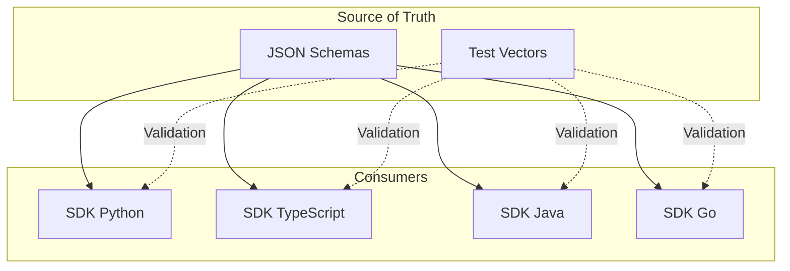

# Talos Contracts & Specifications

**Repo Role**: Source of truth for protocol specifications, test vectors, and release sets. Defines the interface that all SDKs must implement.

## Abstract

Reliable interoperability between independent implementations requires strict adherence to a common specification. This repository contains the canonical JSON schemas, protocol definitions (v1.x), and cryptographically generated test vectors used to validate Talos SDKs across Python, TypeScript, Java, and Go.

## Introduction

In a distributed agent system, ambiguity in protocol implementation leads to fragmentation. `talos-contracts` solves this by providing language-agnostic "contracts" (schemas) and a "vector runner" framework. SDKs do not define the protocol; they implement the contracts defined here.

## System Architecture



This repository is the upstream dependency for all logic-bearing components.

## Technical Design

### Modules

- **test_vectors/**: Golden data for cryptographic primitives and handshake flows.
- **tools/**: Generators (Python) for creating new vector sets.
- **releases/**: Versioned snapshots of protocol definitions.

### Data Formats

- **Release Sets**: JSON files defining feature support (e.g., `v1.1.0.json`).
- **Vectors**: `input` -> `expected` pairs for stateless verification.

## Evaluation

**Status**: Critical Path.

- **Vector Coverage**: 100% of defined primitives.
- **SDK Adherence**: See individual SDK repos for compliance rates against these vectors.

## Usage

### Quickstart

List available vector release sets:

```bash
ls test_vectors/sdk/release_sets/
```

### Common Workflows

1.  **Generate Vectors**: Use `tools/ratchet/generate_vectors.py`.
2.  **Validate Schema**: Use `make typecheck`.

## Operational Interface

- `make test`: Validates vector integrity.
- `make typecheck`: Validates JSON schemas.
- `make interop`: Runs cross-language compatibility tests.
- `scripts/test.sh`: CI entrypoint.

## Security Considerations

- **Threat Model**: Malicious actors trying to exploit implementation differences.
- **Guarantees**:
  - **Determinism**: All SDKs produce bitwise identical outputs for fixed inputs.
  - **Coverage**: Vectors cover edge cases (e.g., key exhaustion, out-of-order messages).

## References

1.  [Protocol v1.1 Spec](./PROTOCOL_V1.1.md) (Placeholder)
2.  [Mathematical Security Proof](https://github.com/talosprotocol/talos/wiki/Mathematical-Security-Proof)
3.  [Talos Wiki](https://github.com/talosprotocol/talos/wiki)
